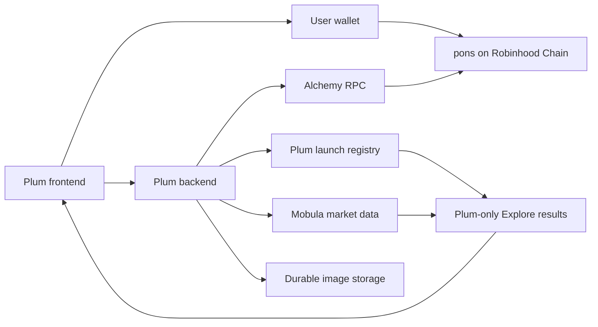

# Plum launches: API and implementation report

Updated September 7, 2026. Technical handoff for replacing Plum's launch prototype with real token creation through pons. This report distinguishes current RPC evidence, documented API capabilities, and proposed application design. No token was deployed, transaction signed, or website published.

For the next session's starting state, preserved decisions and implementation order, use the [integration handoff](LAUNCH-INTEGRATION-HANDOFF.md).

## 1. Decision and readiness

Use **Alchemy for chain access**, **pons v2 for creation**, **a Plum-owned registry for Explore membership**, and **Mobula for market enrichment**. Keep our existing visual identity and grid. Explore must contain launches created through Plum, not a general pons or Robinhood discovery feed.

| Item | Verified state | Implication |
| --- | --- | --- |
| Alchemy mainnet | Chain 4663; HTTP reads and a live WebSocket block succeeded | Ready for read-side development |
| Alchemy testnet | Chain 46630; HTTP reads and a live WebSocket block succeeded | Network access works; protocol deployment is separate |
| Mainnet pons factory/router | Nonempty code at both published addresses; factory getters returned decodable values | The selected read interface works against deployed code |
| Mainnet launch gate | `launchEnabled()` and `canLaunch(0x000000000000000000000000000000000000dEaD)` both returned `1` | The gate reports open at the checked block |
| Testnet pons contracts | No code at those same two mainnet addresses | Obtain actual testnet addresses or use a suitable local fork |
| Mobula | Earlier checks recognized the current v2 factory and returned the reference legacy PONS token | Initial enrichment candidate; full v2 coverage remains untested |
| Plum application | React/Vite prototype; connection, quotes and coins remain local samples | Wallet, backend, registry and transaction handling still need implementation |

**Correction to the earlier discussion:** the accessible [pons v2 documentation](https://docs.ponsfamily.com/v2) said public launches were closed. Subsequent onchain reads report an open gate. Do not retain the earlier blanket allowlisting blocker; perform a fresh wallet-specific preflight. This does not establish that every launch will succeed. The documentation snapshot also describes unfinished audits; no completed audit reports were verified. A later documentation fetch redirected to a regional unavailable page, so documentation findings refer to the accessible snapshot reviewed in this session.

The [RPC evidence](api-evidence/alchemy-rpc-2026-09-07.json) is the source for live findings. Code presence and successful getters are not a source-code audit or an end-to-end creation test.

## 2. Architecture and responsibility



The wallet owns signing. The backend validates requests and receipts, stores membership, caches provider responses and protects credentials. It does not need a signing key, token custody, relayer or sponsored gas for the initial integration. Website hosting remains an ordinary web deployment, separate from creating tokens onchain.

Use protocol state for configuration and transaction outcomes, the registry for membership, and Mobula for display enrichment. A token remains in Explore when its price provider is delayed. Keep provider-specific objects behind adapters so changing providers does not change launch ownership or the product UI.

## 3. Environment and reproducible checks

The repository-root `.env` contains these variables. Git ignores it; the tracked [.env.example](../.env.example) contains blank values only.

| Variable | Purpose |
| --- | --- |
| `MOBULA_API_KEY` | Existing market-data credential |
| `ALCHEMY_API_KEY` | Newly supplied Alchemy credential |
| `ROBINHOOD_RPC_URL` | Supplied mainnet HTTPS endpoint |
| `ROBINHOOD_TESTNET_RPC_URL` | Supplied testnet HTTPS endpoint |

Endpoint templates are `https://robinhood-mainnet.g.alchemy.com/v2/{API_KEY}` and `https://robinhood-testnet.g.alchemy.com/v2/{API_KEY}`. Documented WebSocket counterparts use `wss`; both networks use ETH gas. [Network configuration](https://docs.robinhood.com/chain/connecting/)

Run from the repository root with Node 24:

```sh
node --env-file=.env scripts/check-launch-apis.mjs
```

The [diagnostic](../scripts/check-launch-apis.mjs) uses an explicit read-only HTTP method allowlist, expected-chain/host checks, bounded timeouts and short-lived `newHeads` subscriptions. It saves sanitized JSON under `docs/api-evidence/`; rerunning on the same UTC date replaces that day's report. It never broadcasts transactions and requires no additional package.

Keep credentials out of Vite variables, public assets, logs, screenshots and source control. A deployed backend should receive them through its environment/secret settings. Any future RPC proxy needs request limits and a restricted method set so outsiders cannot freely consume our quota. The diagnostic loads these variables; no runtime backend consumes them yet.

## 4. Alchemy tests and API surface

The final run began at **2026-09-07 12:07:57 UTC**. Mainnet configuration reads were pinned to block **56,821,996** (`0x36308ec`), hash `0x74d4bdded7ff7b1d98d4afb8c725c2a17664b21fa3e80ae290b2f62378bc6492`. Testnet's snapshot was block **114,842,097**. Exact timestamps, values and individual timings are in the evidence.

| Test | Mainnet | Testnet | Evidence boundary |
| --- | --- | --- | --- |
| `eth_chainId` | 4663 | 46630 | Correct network and working access |
| `eth_getBlockByNumber` | Recent block returned | Recent block returned | Block/header reads |
| `eth_gasPrice` | Returned | Returned | Method access, not a launch-cost estimate |
| `eth_getCode` | Factory 24,177 bytes; router 4,416 bytes | Both addresses empty | Deployment presence only on mainnet at these addresses |
| `eth_call` | Seven factory getter/config checks passed | No protocol getters attempted | Selected mainnet ABI reads |
| `eth_getTransactionReceipt` | Known successful legacy launch returned | Not attempted | One positive historical example |
| `eth_getLogs` | Two matching factory logs in that receipt's block | Not attempted | A bounded historical query works |
| WebSocket chain check + `newHeads` | Correct chain; one new block received | Correct chain; one new block received | Basic subscription access |

The final run passed **14 mainnet HTTP checks and 5 testnet HTTP checks**, using 26 HTTP requests including selector hashes, plus two short WebSocket sessions. An initial run used 24 HTTP requests and two short sessions; the second run added `canLaunch` after the unexpected open-gate result. These are functionality checks, not sustained throughput, latency, failover or reconnect benchmarks. `web3_sha3` derives getter selectors without adding an ABI dependency; production should use an established ABI encoder.

| Method | Planned application use | Validation |
| --- | --- | --- |
| `eth_call` | Configuration, eligibility, token state and ABI-client simulation | Getters verified; creation simulation untested |
| `eth_estimateGas` | Estimate the exact prepared launch request | Documented; untested for our payload |
| `eth_getTransactionReceipt` | Confirm success and events | One legacy receipt verified |
| `eth_getTransactionByHash` | Verify target, input, sender and replacements | Documented; untested here |
| `eth_getLogs` | Reconcile tracked launch/curve events | One historical block verified |
| `eth_getBlockByNumber` | Timestamps and canonical-chain checks | Latest block verified |
| WebSocket subscriptions | Wake workers when tracked activity changes | `newHeads` only; filtered logs/recovery untested |
| Wallet transaction submission | Creator signs and sends the reviewed request | No signer connected or transaction submitted |

Alchemy documents [Robinhood RPC methods](https://www.alchemy.com/docs/robinhood-chain/robinhood-chain-api-overview). Working RPC does not establish access to every data, trace, account-abstraction or simulation product. Account billing and dashboard entitlements were not inspected.

## 5. pons configuration and integration surface

| Mainnet role | Address |
| --- | --- |
| Factory | `0x7eD598BcEf8bd9Edd8C97A195C6d13f40801EC7e` |
| Optional launch-and-buy router | `0xe33E9E479dF8802cb0866d5d05258bEc4cF62948` |

Observed at the pinned mainnet block:

| Read | Value |
| --- | --- |
| `launchFee()` | `500000000000000` wei = **0.0005 ETH** |
| `launchEnabled()` | `1` |
| `canLaunch(probeAddress)` | `1`; arbitrary probe, not the user's wallet |
| `maxCreatorTaxBps()` | `1000` = **10%** maximum |
| `launchConfigCount()` | `1` |
| Config 0 supply | `1000000000000000000000000000` raw token units |
| Config 0 curve fee | `100` basis points = **1%** |
| Config 0 phantom quote | `1680000000000000000` raw quote units |
| Config 0 graduation threshold | `4200000000000000000` raw quote units |
| Config 0 pool fee / tick spacing / enabled | `0` / `200` / `1` |
| Native config 0 economics preview | 32-byte hash returned; exact hash in evidence |

These are observations, not production constants. Preserve raw integers and asset decimals. The sample UI's fee numbers happen to match these reads, but its calculation still lacks live terms, gas, balances and transaction validation. A pool-fee field of zero does not establish fee-free trading.

The [pons v2 integration reference](https://docs.ponsfamily.com/v2) documents:

| Operation | Entry points |
| --- | --- |
| Eligibility and terms | `canLaunch`, `launchConfigCount`, `getLaunchConfig`, `launchFee`, `maxCreatorTaxBps` |
| Pair eligibility | `approvedPairTokens`, `pairTokenEconomics` |
| Protect quoted economics | `previewLaunchEconomics` / `expectedEconomics` |
| Create | `launchToken` |
| Create with initial buy | `launchAndBuy`, minimum output and explicit fee recipient |
| Identity and lifecycle | `TokenLaunched`, `getLaunchedToken`, `getTokenInfo` |
| Fees | Per-launch curve/hook state and associated escrow |

v2 uses a curve followed by Uniswap v4 graduation. Use the full published tuple ABI, including metadata, socials, creator settings, economics pin and salt; this table is not a complete ABI. Custom pairs require approved economics, correct decimals and spending approvals. ETH-only is the first proposed milestone. Deploying our own factory or router is not required for it.

## 6. Proposed Create flow

This specifies application behavior, not implemented functionality.

1. **Connect and authenticate.** Request wallet access, show chain/balance and create a short-lived backend session with a wallet-signed domain/nonce challenge. Account or chain changes invalidate prepared requests. Support contract-wallet signature verification if those wallets are included in the release.
2. **Prepare content.** Validate name, ticker, description and image; upload to durable storage and retain its URI. Verify media type/size and prevent arbitrary backend URL fetching. Show the stored preview before signing.
3. **Prepare terms.** Read eligibility, configuration and fees for the actual wallet. Convert decimal strings to integers using the selected asset's decimals. The sample floating-point calculation must not construct transaction amounts.
4. **Bind an intent.** Record a unique launch intent tied to the authenticated wallet, network, target, canonical parameters hash, random salt, metadata URI, economics hash, fee recipient, initial buy and expiry. An idempotency key prevents repeated clicks creating independent submissions.
5. **Simulate and review.** Simulate the exact transaction from the actual account, estimate gas and check balances/allowances. Show creation fee, gas estimate, initial purchase, creator settings and slippage separately. Changed terms require a refreshed review.
6. **Sign in the wallet.** The browser passes the reviewed transaction to the wallet. The backend receives a hash, never a signing key. User rejection returns to the form; a timeout means unresolved submission, not proven failure.
7. **Confirm independently.** Verify the receipt and input against the stored intent. A worker retries pending receipts with bounded backoff and reconciles replacement hashes. On success, store membership and show the token address and explorer link.
8. **Enrich later.** Add the token to Explore after the chosen inclusion policy succeeds. Keep prices/volume unavailable until valid observations arrive; do not wait for Mobula discovery before acknowledging creation.

Initial buy support should use the atomic launch-and-buy path once validated. Sequential creation and purchase are not equivalent. Do not offer the prototype's USDG/cbBTC choices until actual asset addresses and approved economics have been checked. Creator revenue and a proposed Plum platform fee are separate: no partner/referral payment or extra platform fee has been established.

## 7. Plum-only launch membership

The shared factory and creator wallet cannot identify which platform was used. Ticker prefixes, browser flags, client-supplied source labels and arbitrary transaction hashes are insufficient.

Define a Plum launch as a successful transaction matching an authenticated, server-issued intent recorded **before** submission. Verify chain, known factory event, deployed token/curve, creator, transaction target/input, metadata/settings, salt and value. For forwarded calls, decode the supported router path and initiating creator correctly. A successful unrelated receipt must be rejected.

Use a durable relational store with uniqueness constraints and atomic writes; choose its hosting with the backend.

| Record | Minimum fields |
| --- | --- |
| `launch_intents` | ID, wallet, chain, target, parameters hash, salt, metadata URI, expiry, status, idempotency key |
| `launches` | Chain, token, curve, factory/version, creator, intent, transaction hash, event index, block number/hash, confirmation state, creation time |
| `market_snapshots` | Chain/token, source, observed time, retrieved time, values, freshness/error status |
| `sync_cursors` | Network/stream scope, last processed block/hash, update time |

Enforce unique `(chainId, token)` and `(chainId, transactionHash, logIndex)`, plus one consumed result per intent. Preserve cancelled/replaced submissions for reconciliation. Store UTC timestamps and verify block hashes when resuming workers.

Distinguish transaction inclusion from stronger chain settlement. A reorganization should retract or downgrade affected entries and replay from a safe cursor. Validate the precise confirmation policy against Robinhood's current finality behavior; no fixed seconds/confirmation count is established here.

This proves participation in our backend workflow, not which browser UI was physically used. Independently verifiable onchain platform attribution would require a supported partner marker or compatible dedicated router. Confirm that need and its forwarding/fee implications with pons before introducing another contract. A local fork is testing infrastructure, not a replacement pons deployment.

## 8. Proposed backend API

These routes are proposed, not existing endpoints. Responses must exclude provider secrets and raw upstream errors.

| Route | Contract |
| --- | --- |
| `POST /api/auth/challenge` | Wallet/domain nonce with bounded expiry |
| `POST /api/auth/verify` | Verify signature and establish session |
| `POST /api/uploads` | Validate/store media; return content URI |
| `GET /api/launch-config?chainId=4663` | Supported settings, source block, freshness and applicable eligibility |
| `POST /api/launch-intents` | Authenticated parameters/idempotency key; return intent, expiry and prepared terms |
| `POST /api/launch-intents/:id/submission` | Candidate hash; pending until independently verified |
| `GET /api/launch-intents/:id` | Pending, confirmed, replaced, reverted, expired or reconciliation state |
| `GET /api/launches` | Paginated, searchable Plum registry; filters remain within membership |
| `GET /api/launches/:chainId/:token` | Identity, protocol state and separately timestamped market data |
| `GET /api/launches/:chainId/:token/candles` | Bounded, cached chart query for a registered token |

Authenticate writes, verify session/request origins, cap request sizes and rate-limit calls. Reconcile pending submissions after restarts. Polling with shared server caching is sufficient for the first iteration; a permanent worker/WebSocket process is a hosting decision once the refresh requirement is settled.

## 9. Mobula endpoints and evidence

Production base: `https://api.mobula.io`. Use the saved key in the authorization header from the backend. The tested Robinhood identifier is `evm:4663`. Prose sometimes uses friendly blockchain names; verify accepted parameters and returned identity for each endpoint rather than moving aliases between APIs.

| Capability | Endpoint and parameters | Plum use and boundary |
| --- | --- | --- |
| Protocol metadata | `GET /api/1/system-metadata`; factories, pool types, chain/name filters | [Schema](https://docs.mobula.io/rest-api-reference/endpoint/system-metadata). v2 recognition verified earlier; returned filters required local checking |
| Token details | `GET /api/2/token/details`; `chainId`, `address` | [Schema](https://docs.mobula.io/rest-api-reference/endpoint/token-details). Legacy PONS identity/price response verified; card enrichment candidate |
| Markets | `GET /api/2/token/markets`; chain/address, `limit` 1-25 | [Schema](https://docs.mobula.io/rest-api-reference/endpoint/token-markets). Capped results are not an exhaustive historical index; preserve protocol-derived market identity |
| Trades | `GET /api/2/token/trades`; chain/address, explicit mode, order, pagination | [Schema](https://docs.mobula.io/rest-api-reference/endpoint/token-trades). Verify asset/pair semantics; token mode aggregates selected pools |
| Candles | `GET /api/2/token/ohlcv-history`; chain/address, period, from/to, amount, usd, fill | [Schema](https://docs.mobula.io/rest-api-reference/endpoint/token-ohlcv-history). Prose specifies milliseconds, max 2,000 candles, fill=false default; validate time range and lifecycle continuity |
| Discovery/streaming | Pulse HTTP and pulse-v2 WebSocket | [Reference](https://docs.mobula.io/indexing-stream/stream/websocket/pulse-stream-v2). Optional enrichment, not membership; WSS documented for Growth/Enterprise, untested with this key |

### Earlier checks retained

Three successful read-only production requests used the saved Mobula key. Metadata returned factories beyond the requested chain/name filters. A second inspection filtered locally: 457 factories overall, 55 on Robinhood, the current pons v2 factory and `pons-v2` were present. Token details returned chain/address-matching legacy PONS at `0x39dBED3a2bd333467115dE45665cC57F813C4571`, source `pons`, with price data. That was an access/identity check, not a price-accuracy or v2 lifecycle test. No Mobula stream, webhook, rebuild or account change was performed. These earlier observations were not rerun during the Alchemy test.

Mobula's [pons guide](https://docs.mobula.io/almanac/robinhood-launchpads/pons) describes the older V3-pool model. Factory metadata can recognize v2 while the prose guide still describes earlier behavior. Protocol state and receipts remain the integration authority.

### Data-quality acceptance

Test known v2 tokens before, during and after graduation. Measure first-token visibility after the receipt, compare a bounded trade sample to receipts, inspect candle gaps/pair orientation and verify missed-event recovery after reconnect. Display observations and execution quotes serve different purposes. Missing fields must not become zero balances, zero fees or safety claims.

Cache tokens needed by the registry and current pages; coalesce requests across visitors. Preserve observed/fetched timestamps and label stale data. Retry 429/transient errors with bounded backoff; distinguish empty data, unsupported routes and plan denial. Provider labels and aggregate trade counts are not creator identity or platform attribution evidence.

## 10. Costs and alternatives

Alchemy lists Free at **30 million CU/month**. PAYG charges **$0.45/million CU for the first 300 million**, then **$0.40/million**. Its examples charge total PAYG usage without subtracting Free's allowance. A paid usage cap is available. At published rates, 100M CU costs $45 and 460M costs $199 before separately billed products. This account's selected plan was not inspected. [Pricing FAQ](https://www.alchemy.com/docs/reference/pay-as-you-go-pricing-faq)

Calls have different weights: `eth_call` is 26 CU, a receipt 20, and `eth_getLogs` 60. One shared contract read every 10 seconds for 30 days means 259,200 calls or 6,739,200 CU at that rate. This illustrates caching benefits, not forecast traffic. Batch transport does not make inner calls free. [CU schedule](https://www.alchemy.com/docs/reference/compute-unit-costs)

Robinhood mainnet's documented Free log-query range is **10 blocks per request**. The one-block historical check fits this, without establishing efficient bulk backfill or account-specific larger ranges. Start from tracked intents/receipts and bounded recovery windows; evaluate PAYG when catch-up or throughput makes Free impractical. [Log limits](https://www.alchemy.com/docs/chains/robinhood-chain/robinhood-chain-api-endpoints/eth-get-logs)

Mobula lists Free at 10,000 monthly credits/1 RPS; Start-up at $50 with 125,000 credits/30 RPS; Growth at $400 with 1.25M credits/50 RPS and WSS; Enterprise from $750. Token candles cost 5 credits/request and token-detail batches 1 credit/token; stream usage adds consumption. The supplied key's plan is unknown. One token refreshed continuously every minute means 43,200 monthly requests before chart calls, so Free is not an always-on feed budget. [Mobula pricing](https://docs.mobula.io/pricing)

Budget separately for RPC, market data, backend/database, images, website hosting and user-paid chain fees. The observed **0.0005 ETH** creation fee excludes gas and any initial buy. Neither the observed gas price nor the old reference receipt's gas usage estimates a new v2 launch accurately. No paid upgrade or spending cap was configured.

| Alternative | When to compare | Evidence |
| --- | --- | --- |
| QuickNode RPC | Alchemy availability, support, throughput or backfill becomes unsuitable | [Robinhood lists support](https://docs.robinhood.com/chain/connecting/); no comparative benchmark |
| Codex market-data API | Mobula v2 candles, freshness or trade coverage falls short | [Robinhood 4663 supported](https://docs.codex.io/networks); v2 coverage untested; unrelated to the Codex development app |
| Allium | Broader historical datasets/custom analytics become central | [Mainnet data coverage](https://www.allium.so/blog/supporting-robinhood-chain-at-launch/); no subscription/benchmark |

Keep Alchemy and Mobula for the initial implementation; compare alternatives against a demonstrated gap before buying another service. Mobula has useful observed coverage, not proof of universal superiority.

## 11. Implementation sequence and acceptance

| Stage | Deliverable | Required checks |
| --- | --- | --- |
| 1. Live configuration | Server adapters and wallet/network connection | Wrong network/account changes, missing keys, denied RPC, stale settings |
| 2. Registry/uploads | Authenticated intents, durable media and Plum-only Explore | Reject unrelated/forged hashes; duplicates, restart recovery, media validation |
| 3. ETH-only creation | ABI encoding, pinned terms, simulation and wallet review | Realistic fork or confirmed testnet deployment; closed gate, changed terms, insufficient balance, user rejection |
| 4. Initial buy | Atomic router path with minimum output | Creator/recipient attribution, slippage, integer rounding, replacement transactions |
| 5. Enrichment | Registry-scoped details, trades and charts | Lag, missing data, rate limits, graduation continuity, stale cache |
| 6. Production readiness | Reviewed hosting/secrets, alerts and recovery | End-to-end launch with explicitly approved wallet/funds/parameters; no silent mainnet fallback |

A confirmed pons testnet deployment or suitable local fork remains necessary for realistic creation tests. Working testnet RPC does not supply missing protocol contracts. Fork tests must use actual deployed code/state and declared caller conditions; mocked UI success is not a contract test.

Frontend integration will need a wallet connector and ABI client, for example viem with an appropriate React connector. None was added. Backend framework, database host, image provider, domain and deployment remain undecided. Preserve our form/grid aesthetic; make connection, data and transaction states real rather than redesigning the pages.

## 12. Not established by this work

- Successful creation, signed transactions, live trading or creator fee claims.
- Eligibility/gas simulation for the user's actual wallet and payload.
- Verified source correspondence, closed audits or a production security review.
- Actual pons testnet addresses or approved USDG/cbBTC addresses/economics.
- Sustained reliability, archive completeness, reconnect recovery or failover.
- Mobula v2 lifecycle completeness, streaming entitlement or account billing plan.
- A Plum referral agreement, independently verifiable onchain Plum marker or permission to claim an official partnership.

Credentials and read-only diagnostics are ready for development. The next work is the server-backed launch flow and registry, controlled contract testing, and then an explicitly reviewed real launch.
